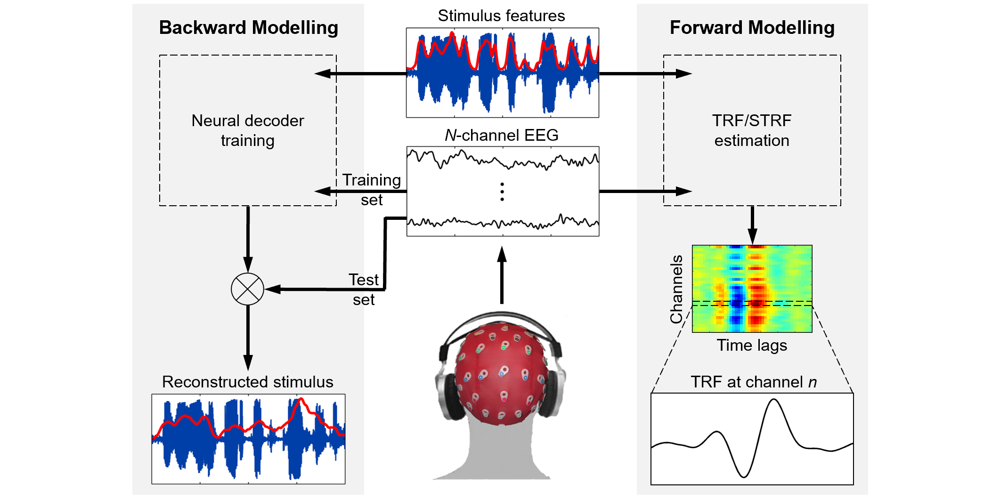
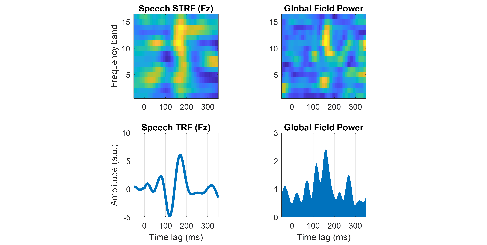
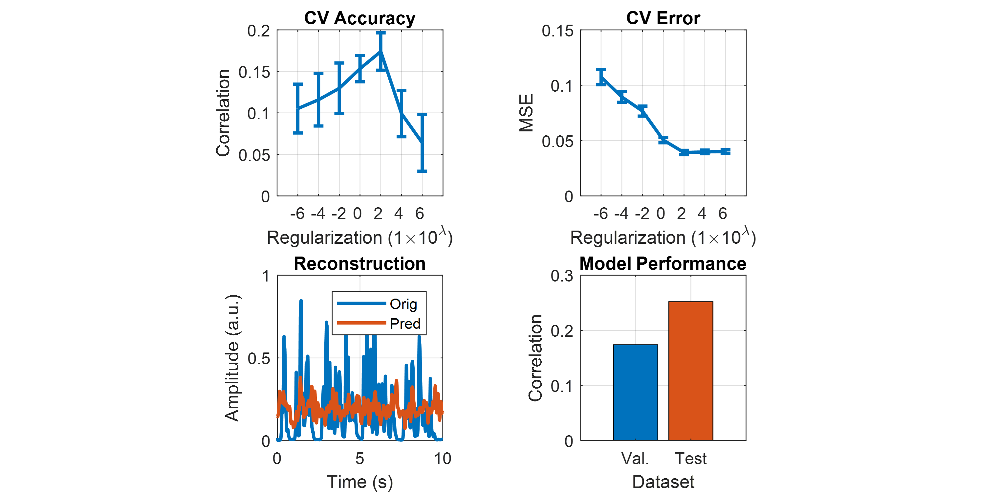
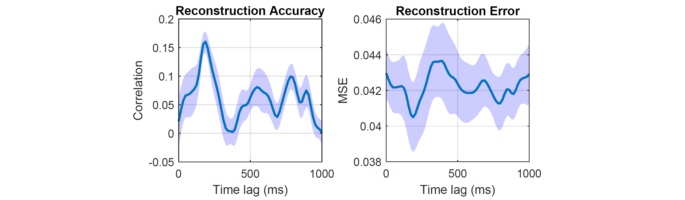

# Semantic_Dissimilarity_Project


### Introduction

There is continued debate on whether context-based predictions of upcoming words feed back to affect the acoustic processing of speech, especially in the context of natural, continuous speech.

Recently, using narrative speech, our group showed that the more semantically similar a word is to its preceding context, the better it is encoded at acoustic-phonetic levels, providing evidence of an influence of top-down feedback.

Here, we aim to replicate this finding in the context of a cocktail-party attention experiment. 

Doing so would allows us to confirm that our result is genuinely driven by top-down predictive activity and not by any confounding acoustic-linguistic correlations.

The more semantically similar a word is to its preceding context, the better it is encoded at the acoustic-phonetic levels, providing evidence for an influence of top-down feedback

We explored this using a cocktail party attention paradigm, where participants must attend to one of two competing speakers. Stimulus were natural continuous speech.
Using computational modeling we were able to investigate this in a two stage processes.

Stage 1: first we represented speech in its lower-level representations, the speech amplitude envelope. And at a higher level we parametrised speech in terms of its surprisal and semantic similarity using computational language models
Stage 2: we used the word level envelope reconstructions accuracies and passed it on to stage 2 and regressed against semantic similarity and surprisal.

### Websites
GloVe: Global Vectors for Word Representation: https://nlp.stanford.edu/projects/glove/<br/> 
Dataset Dryad: https://datadryad.org/stash/landing/show?big=showme&id=doi%3A10.5061%2Fdryad.070jc<br/>
<br/>
 
  ## mTRF Modelling Framework

mTRF-Toolbox provides a complementary forward/backward quantitative modelling framework. A forward model, known as a temporal response function or temporal receptive field (TRF), describes how sensory information is encoded in neuronal activity. Multivariate stimulus features such as spatio- or spectro-temporal representations, as well as categorical features such as phonetic or semantic embeddings, can be used as inputs to the model. TRFs can be subjected to conventional time-frequency/source analysis techniques or used to predict the neural responses to an independent set of stimuli. mTRF-Toolbox provides an efficient cross-validation procedure for hyperparameter optimization.

A backward model, known as a neural decoder, reverses the direction of causality between stimulus and response. Neural decoders can be used to reconstruct stimulus features from information encoded explicitly or implicitly in neuronal activity, or decode higher-order cognitive processes such as top-down attention. The mTRF modelling framework provides a basic machine learning platform for real-time BCI applications such as stimulus reconstruction/synthesis and auditory attention decoding (AAD).


<div align="center">
  
</div>

## Contents

### Fitting encoding/decoding models

* `mTRFcrossval()` - performs efficient leave-one-out cross-validation
* `mTRFtrain()` - fits an encoding/decoding model (TRF/STRF estimation)
* `mTRFtransform()` - transforms a decoding model into an encoding model
* `mTRFpredict()` - predicts the output of an encoding/decoding model
* `mTRFevaluate()` - evaluates the accuracy and error of a models prediction

### Decoding attention and multisensory integration

* `mTRFattncrossval()` - cross-validation for attention decoder optimization
* `mTRFattnevaluate()` - evaluates the accuracy and modulation index of an attention decoder
* `mTRFmulticrossval()` - cross-validation for additive multisensory model optimization
* `mTRFmultitrain()` - fits an additive multisensory model (TRF/STRF estimation)

### Feature engineering

* `mTRFenvelope()` - computes the temporal envelope of an audio signal
* `mTRFresample()` - resamples and smooths temporal features
* `lagGen()` - generates time-lagged input features of multivariate data

## Examples

### TRF/STRF estimation

Here, we estimate a 16-channel spectro-temporal response function (STRF) from 2 minutes of EEG data recorded while a human participant listened to natural speech. To map in the forward direction (encoding model), we set the direction of causality to 1. To capture the entire STRF timecourse, the time lags are computed between -100 and 400 ms. The regularization parameter is set to 0.1 to reduce overfitting to noise.

```matlab
% Load example speech dataset
load('mTRF-Toolbox/data/speech_data.mat','stim','resp','fs','factor');       

% Estimate STRF model weights
model = mTRFtrain(stim,resp*factor,fs,1,-100,400,0.1);
```

We compute the broadband TRF by averaging the STRF model across frequency channels and the global field power (GFP) by taking the standard deviation across EEG channels, and plot them as a function of time lags. This example can also be generated using [plot_speech_STRF](examples/plot_speech_strf.m) and [plot_speech_TRF](examples/plot_speech_trf.m).

```matlab
% Plot STRF
figure
subplot(2,2,1), mTRFplot(model,'mtrf','all',85,[-50,350]);
title('Speech STRF (Fz)'), ylabel('Frequency band'), xlabel('')

% Plot GFP
subplot(2,2,2), mTRFplot(model,'mgfp','all','all',[-50,350]);
title('Global Field Power'), xlabel('')

% Plot TRF
subplot(2,2,3), mTRFplot(model,'trf','all',85,[-50,350]);
title('Speech TRF (Fz)'), ylabel('Amplitude (a.u.)')

% Plot GFP
subplot(2,2,4), mTRFplot(model,'gfp','all','all',[-50,350]);
title('Global Field Power')
```



### Stimulus reconstruction

Here, we build a neural decoder that can reconstruct the envelope of the speech stimulus heard by the EEG participant. First, we downsample the data and partition it into 6 equal segments for training (segments 2 to 6) and testing (segment 1).

```matlab
% Load data
load('mTRF-Toolbox/data/speech_data.mat','stim','resp','fs');

% Normalize and downsample data
stim = resample(sum(stim,2),64,fs);
resp = resample(resp/std(resp(:)),64,fs);
fs = 64;

% Partition data into training/test sets
nfold = 6; testTrial = 1;
[strain,rtrain,stest,rtest] = mTRFpartition(stim,resp,nfold,testTrial);
```

To optimize the decoders ability to predict stimulus features from new EEG data, we tune the regularization parameter using an efficient leave-one-out cross-validation (CV) procedure.

```matlab
% Model hyperparameters
Dir = -1; % direction of causality
tmin = 0; % minimum time lag (ms)
tmax = 250; % maximum time lag (ms)
lambda = 10.^(-6:2:6); % regularization parameters

% Run efficient cross-validation
cv = mTRFcrossval(strain,rtrain,fs,Dir,tmin,tmax,lambda,'zeropad',0,'fast',1);
```

Based on the CV results, we train our model using the optimal regularization value and test it on the held-out test set. Model performance is evaluated by measuring the correlation between the original and predicted stimulus.

```matlab
% Find optimal regularization value
[rmax,idx] = max(mean(cv.r));

% Train model
model = mTRFtrain(strain,rtrain,fs,Dir,tmin,tmax,lambda(idx),'zeropad',0);

% Test model
[pred,test] = mTRFpredict(stest,rtest,model,'zeropad',0);
```

We plot the CV metrics as a function of regularization and the test results of the final model. This example can also be generated using [stimulus_reconstruction](examples/stimulus_reconstruction.m).

```matlab
% Plot CV accuracy
figure
subplot(2,2,1), errorbar(1:numel(lambda),mean(cv.r),std(cv.r)/sqrt(nfold-1),'linewidth',2)
set(gca,'xtick',1:nlambda,'xticklabel',-6:2:6), xlim([0,numel(lambda)+1]), axis square, grid on
title('CV Accuracy'), xlabel('Regularization (1\times10^\lambda)'), ylabel('Correlation')

% Plot CV error
subplot(2,2,2), errorbar(1:numel(lambda),mean(cv.err),std(cv.err)/sqrt(nfold-1),'linewidth',2)
set(gca,'xtick',1:nlambda,'xticklabel',-6:2:6), xlim([0,numel(lambda)+1]), axis square, grid on
title('CV Error'), xlabel('Regularization (1\times10^\lambda)'), ylabel('MSE')

% Plot reconstruction
subplot(2,2,3), plot((1:length(stest))/fs,stest,'linewidth',2), hold on
plot((1:length(pred))/fs,pred,'linewidth',2), hold off, xlim([0,10]), axis square, grid on
title('Reconstruction'), xlabel('Time (s)'), ylabel('Amplitude (a.u.)'), legend('Orig','Pred')

% Plot test accuracy
subplot(2,2,4), bar(1,rmax), hold on, bar(2,test.r), hold off
set(gca,'xtick',1:2,'xticklabel',{'Val.','Test'}), axis square, grid on
title('Model Performance'), xlabel('Dataset'), ylabel('Correlation')
```



### Single-lag decoder analysis

Here, we evaluate the contribution of individual time lags towards stimulus reconstruction using a single-lag decoder analysis. First, we downsample the data and partition it into 5 equal segments.

```matlab
% Load data
load('mTRF-Toolbox/data/speech_data.mat','stim','resp','fs');

% Normalize and downsample data
stim = resample(sum(stim,2),64,fs);
resp = resample(resp/std(resp(:)),64,fs);
fs = 64;

% Generate training/test sets
nfold = 10;
[strain,rtrain] = mTRFpartition(stim,resp,nfold);
```

We run a leave-one-out cross-validation to test a series of single-lag decoders over the range 0 to 1000 ms using a pre-tuned regularization parameter.

```matlab
% Run single-lag cross-validation
[stats,t] = mTRFcrossval(strain,rtrain,fs,-1,0,1e3,10.^-2,'type','single','zeropad',0);

% Compute mean and variance
macc = squeeze(mean(stats.r))'; vacc = squeeze(var(stats.r))';
merr = squeeze(mean(stats.err))'; verr = squeeze(var(stats.err))';

% Compute variance bound
xacc = [-fliplr(t),-t]; yacc = [fliplr(macc-sqrt(vacc/nfold)),macc+sqrt(vacc/nfold)];
xerr = [-fliplr(t),-t]; yerr = [fliplr(merr-sqrt(verr/nfold)),merr+sqrt(verr/nfold)];
```

We plot the reconstruction accuracy and error as a function of time lags. This example can also be generated using [single_lag_analysis](examples/single_lag_analysis.m).

```matlab
% Plot accuracy
figure
subplot(1,2,1), h = fill(xacc,yacc,'b','edgecolor','none'); hold on
set(h,'facealpha',0.2), xlim([tmin,tmax]), axis square, grid on
plot(-fliplr(t),fliplr(macc),'linewidth',2), hold off
title('Reconstruction Accuracy'), xlabel('Time lag (ms)'), ylabel('Correlation')

% Plot error
subplot(1,2,2)
h = fill(xerr,yerr,'b','edgecolor','none'); hold on
set(h,'facealpha',0.2), xlim([tmin,tmax]), axis square, grid on
plot(-fliplr(t),fliplr(merr),'linewidth',2), hold off
title('Reconstruction Error'), xlabel('Time lag (ms)'), ylabel('MSE')
```



### Task
Reconstruct the speech envelopes using the backwards TRF as the time series data of the<br/> 
reconstructions themselves also are input to the function. You can do this with the standard backwards TRF<br/> 
approach on the cocktail party data. I've also attached the speech envelopes for both speech streams just in case.<br/>  
(Also note that everything here is sampled at 64Hz)<br/> 
<br/> 

The goal is to estimate beta weights for the attended and unattended speech streams.<br/> 
This means dividing the subjects into 2 groups based on what they attended to (i.e. a journey and a twenty group)<br/> 
and running the function 4 times:<br/> 
Journey with stim = journey,  Journey with stim = twenty,  Twenty with stim= twenty and twenty with stim=journey.<br/> 
 
 ## Cocktail Party Experiment

Files
eegData: EEG Data, Time Locked to the onset of the speech stimulus.   
Format: Channels (128) x Time Points

mastoids: Mastoid Channels, Time Locked to the onset of the speech stimulus. 
Format: Channels (Left=1 Right=2) x Time Points

fs: Sampling Rate

EEG data is unfiltered, unreferenced and sampled at 128Hz

Experiment Information
Subjects 1-17 were instructed to attend to 'Twenty Thousand Leagues Under the Sea' (20000), played in the left ear
Subjects 18-33 were instructed to attend to 'Journey to the Centre of the Earth' (Journey), played in the right ear

### Peripheral Notes
So contrary to what the dryad readme file says the following subjects<br/> 
 (as indexed by their number on dryad) listened to twenty and journey<br/> 

twenty = 3     6     7     8     9    10    13    15    17    18    19    21    24    25    27    31    32<br/> 
journey =  1     2     4     5    11    12    14    16    20    22    23    26    28    29    30    33<br/> 

